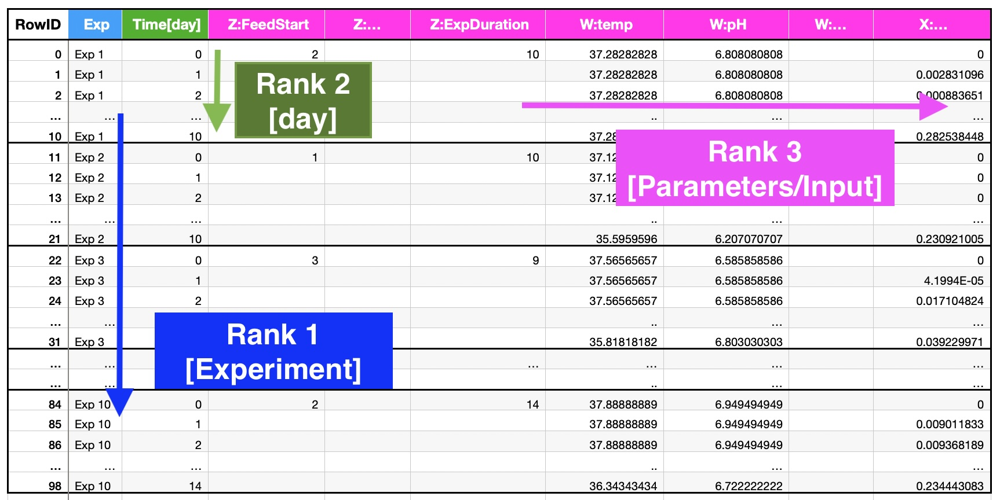
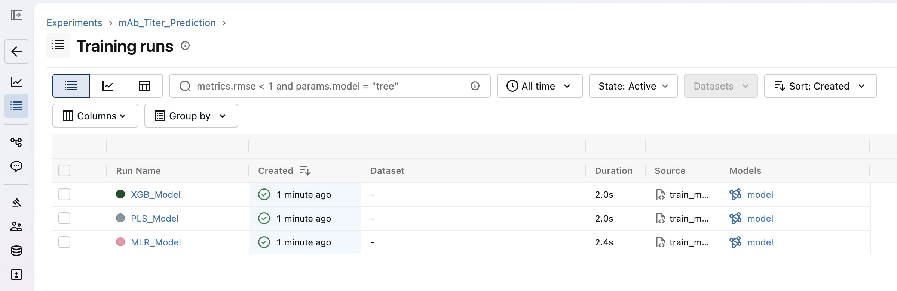

# Predicting Titer of a Simulated Upstream Bioprocess

## Task

Predict **the final mAb product titer** of a simulated fed-batch upstream bioprocess from a mix of scalar process settings and daily time-series process data.

## Workflow

1. **Raw data validation**: Validate data quality
2. **Data preparation**: Clean and preprocess data
3. **Data transformation**: Feature engineering
4. **Feature storage**: Manage engineered features
5. **Baseline model training**: Train baseline model
6. **Uncertainty quantification**: Quantify model uncertainty with MAPIE
7. **Model versioning**: Track metrics and version models, and log model performance
8. **Implementation**: Design ML workflow architecture, adopt MLOps lifecycle, linting and format checking, and documentation
8. **Model deployment**: Deploy and containerize model with Uvicorn/Docker and test inference requests

I use Notion with Kanban board to track tasks' status for this project.
Link: https://app.notion.com/p/Predicting-mAb-Titer-Tasks-to-Done-220ea55998d882d1aec7019f8abeef3b

> Useful materials for learning Titer prediction and bioprocess:
> 1. https://www.sciencedirect.com/science/article/pii/S1369703X23000086
> 2. https://datahow.ch/model-based-upstream-process-optimization/

## Inference App

### 1. Environment Setup
```sh
git clone <repository-url>
cd ml-titer
python -m venv .venv
source .venv/bin/activate
pip install uv
uv sync
```

### 2. Serve Model Server

An endpoint on the App server using FastAPI framework handles the prediction requests and returns the value predicted by the deployed ML pipeline. The endpoint is server/predict with a **POST** operation.

1) Use Uvicorn Server
```sh
uv run uvicorn main:app --host 0.0.0.0 --port 8000
```

2) Use Docker to containerize this server
```sh
docker build -t ml-titer .
docker run --rm -p 8000:8000 ml-titer
```

You can visit `http://localhost:8000/docs` to see the API documentation.

### 3. Health Check (`GET /health`)
```sh
curl -X GET http://0.0.0.0:8000/health
```

Response
```json
{
  "status": "healthy"
}
```

### 4. List Availabel Models (`GET /models`)
```sh
curl http://0.0.0.0:8000/models
```

Response
```json
{
  "active_model": "pls_model.joblib",
  "available_models": [
    {
      "id": "mlr",
      "algorithm": "Multiple Linear Regression (MLR)",
      "file": "mlr_model.joblib"
    },
    {
      "id": "pls",
      "algorithm": "Partial Least Squares (PLS)",
      "file": "pls_model.joblib"
    },
    {
      "id": "xgb",
      "algorithm": "XGBoost Regressor",
      "file": "xgb_model.joblib"
    }
  ]
}
```

### 5. Inference Request (`POST /predict`)

**Create payload from YAML file**
```sh
python spec_yml_to_json.py > payload.json
```

Example `payload.json` :
```json
{
  "model": "pls",        # Options: mlr, pls, xgb
  "timestamps": [...],
  "values": {...},
}
```

**Make inference request**
```sh
curl -X POST http://0.0.0.0:8000/predict \
    -H "Content-Type: application/json" \
    --data @payload.json
```

Response
```json
{
  "status": "success",
  "prediction": 2541.33,
  "unit": "mg/L",
  "uncertainty": 390.24,
  "confidence_interval": {
    "lower_bound": 2151.09,
    "upper_bound": 2931.57
  },
  "model_info": {
    "name": "PLSRegression",
    "version": "1.0.0",
    "file": "pls_model.joblib"
  }
}
```

## Project Structure

```
├── data
│   ├── *.csv                     # Dataset files
├── Dockerfile                    # Docker file
├── inference_server_spec.yml     # Example inference spec yaml
├── main.py                       # App microservice
├── ml
│   ├── data.py                   # Helper functions for data processing
│   ├── mlflow_utils.py           # Helper functions for MLflow
│   ├── model.py                  # Helper functions for model training
│   └── train_model.py            # Script to train models for inference request
├── models
│   ├── *.joblib                  # Pretrained models for inference request
├── notebook
│   ├── baseline.ipynb            # Baseline model
│   ├── eda.ipynb                 # Data exploration, cleaning & feature engineering, visualizations
│   └── test_template.ipynb       # Test model prediction
├── pyproject.toml                # Project configuration
├── README.md                     # This file
├── spec_yml_to_json.py           # Script to convert inference server yml to JSON file
├── tests
│   ├── test_*.py                 # Pytest tests
└── uv.lock                       # uv configuration
```

## Understanding the Dataset



| File                                          | Content                                                                                  |
| --------------------------------------------- | ---------------------------------------------------------------------------------------- |
| `datahow_interview_train_data.csv`            | Training inputs, long format (one row per experiment × day), 100 experiments / 990 rows. |
| `datahow_interview_train_targets.csv`         | Training targets, one row per experiment.                                                |
| `datahow_interview_test_data.csv`             | Test inputs (same schema), 20 experiments / 300 rows.                                    |
| `datahow_interview_test_targets-TEMPLATE.csv` | Submission placeholder (dummy `2000` values).                                            |

- `Z:` scalar parameters
- `W:` control profiles
- `X:` measured observations
- `Y:Titer` target (one scalar per experiment)

**See [eda.ipynb](./notebook/eda.ipynb) for exploratory data analysis (EDA)**

### Characteristics of the Data

1. Very small sample size: 
   - 100 experiments for training (10 held out as the final test set for 10-fold CV).
2. Mixed data types: 
   - static scalar process settings (`Z:*`), time-varying control profiles (`W:*`), and time-varying measurements (`X:*`) of different, ragged lengths (7-14 days).
3. Strong multicollinearity: 
   - `Z:*` parameters are generated from a designed experiment (feed start/end, pH/temp start-end-shift are linked)
   - Time-series summary features (final/max/mean/AUC of the same variable) are highly correlated with each other.
4. Single scalar target per experiment: 
   - Titer is measured only at the end, i.e., this is a batch-to-scalar regression problem, not a sequence-to-sequence forecasting problem.
5. Underlying process is *nonlinear* 
   - E.g. microbial/cell growth kinetics, feed-limited dynamics, saturation effects

## Challenges of the Training and Test sets

- **Experiment duration mismatch**: Experiment runs for a different duration (7, 8, 9, or 14 days, set by `Z:ExpDuration`, starting from day 0), while in the test set the experiment is recorded for 14 days. Fortunately, the goal of this task is to **predict only the titer at the final/day-14 timepoint**, with full days 0–14 already given in the test set, and it is not a titer-per-day prediction.
- Even though zero-padding technique to make experiment 14-day rows is tempting here because it will make training set shape match the test set shape, but it can cause more problems; e.g. it creates spurious features and zeroes have no meaningful physical meaning. Therefore, I decided to go for **one row per experiment** by compressing an entire experiment feature into a single summary.
- **Parameter mismatches within the dataset**: For example, in the first experiment, final Temp on day 0 (`35.07070707`) does not match the temperature on last day (`37.28282828`). In fact, they are supposed to be the same value. 
- **Overfitting**: Small amount of training samples ($N = 100$) could make model prone to overfitting. I first start with different models and evaluate them using the cross-validation technique: linear/optimization-based models like partial least squares (PLS)/regularized linear models, multiple linear regression (MLR), tree-based models like Random Forest (RF)/Gradient Boosting, XGBoost, and probabilistic-based models like Gaussian Process (GP).

## Domain-Informed (Engineered) Feature

The following are two new, important, domain-based features computed in EDA from time-series observations $X(t)$ and controls $W(t)$:

### 1. Specific Cell Growth Rate (`VCD_growth_rate`)
Quantifies overall net logarithmic cell growth rate across the experiment duration:
```math
\text{VCD\_growth\_rate} = \frac{1}{t_{\text{final}}} \ln\left(\frac{\max(\text{VCD}_{\text{final}}, 10^{-6})}{\max(\text{VCD}_0, 10^{-6})}\right)
```

### 2. Time to Peak Viable Cell Density (`VCD_time_to_peak`)
Identifies the day when viable cell density reaches its maximum, marking the transition into the stationary/death phase:
```math
\text{VCD\_time\_to\_peak} = t_{\arg\max_i \text{VCD}_i}
```

***Note that these two features are highly correlated.***

A list of 18 non-redundant filtered features selected via target correlation ($|r| \ge 0.25$) and pairwise multicollinearity pruning ($|r_{\text{pair}}| < 0.85$): 

```
'VCD_time_to_peak', 'Lysed_slope', 'VCD_auc',
'Lac_auc', 'Z:ExpDuration', 'FeedGlc_auc',
'FeedGln_slope', 'VCD_final', 'FeedGln_auc',
'Lac_slope', 'FeedGln_final', 'ph_shift_reached',
'pH_final', 'FeedGlc_final', 'temp_final',
'temp_shift_reached', 'Glc_final', 'Z:tempStart'
```

## The Guideline on Selecting Models

1. Start with **PLS regression** on the engineered per-experiment feature table as an interpretable benchmark, tuning the number of latent components by cross-validated $R^2$/MAE.
2. Use **Gradient Boosting or Random Forest** as the primary predictive model, because it captures nonlinearity without overfitting on 100 samples when combined with shallow trees, few boosting rounds/strong shrinkage, and rigorous CV (repeated K-fold given the small N).
3. Use physically meaningful features: AUC/final-value summaries, and do not use dozens of redundant statistics.
4. Use **PCA** to analyze and/or reduce dimensionality of correlated features and identify the most important features.
5. Consider a **Gaussian Process** because it is an uncertainty-aware model.  
6. Consider a **hybrid mechanistic + ML model** - it is the most scientific option for a process (especially for bioprocessing) with known cell-growth kinetics.
7. We should use deep learning (e.g. LSTM or GRU) when we have more training data, or at least use a small model architecture.

## What Baseline Models Showed: 47 Features vs. 18 Filtered Features

I evaluated baseline models under 5-fold $\times$ 10-repeat cross-validation comparing the **47 features** against the **18 features** ($|r_{\text{pair}}| < 0.85$):

| Model | $R^2$ (47 features) | $R^2$ (18 filtered features) | $\Delta R^2$ | RRMSE (47 features) | RRMSE (18 filtered features) |
|---|---|---|---|---|---|
| **PLS (5 comp.)** | 0.7244 | 0.7714 | +0.0470 | 26.8% | 24.6% |
| **Ridge Regression** | 0.7616 | 0.7679 | +0.0063 | 25.1% | 25.0% |
| **MLR** | 0.6243 | 0.7238 | +0.0995 | 30.6% | 27.2% |
| **Random Forest** | 0.7311 | 0.7135 | -0.0176 | 27.6% | 28.6% |
| **Gradient Boosting** | 0.7925 | 0.7088 | -0.0837 | 24.4% | 29.0% |
| **XGBoost** | 0.7264 | 0.6486 | -0.0778 | 28.0% | 30.9% |

**See [baseline.ipynb](./notebook/baseline.ipynb) for baseline model and [test_template.ipynb](./notebook/test_template.ipynb) for test template.**

### Summary:
- **PLS, Ridge, and MLR perform best on the 18 filtered feature set**:
  - PLS $R^2$ reaches 0.771 with lowest RRMSE 24.6%.
  - Unregularized MLR $R^2$ increases from 0.624 to 0.724 (+10 percentage points).
- **Tree Ensembles (GB 0.793, RF 0.731)** perform best on the full 47-feature set where decision tree splits handle non-linear interactions across all raw variables.

### Top Choice

- **Best baseline model**: PLS with 5 components ($\text{R}^2 = 0.7714$, $\text{RRMSE} = 24.6%$).
- **Reason**: It handles multicollinearity in bioprocess features effectively.

## App for Inference

- **OpenAPI YAML vs. JSON DTO**: Sample inference input data is provided as an example in an OpenAPI spec file (`inference_server_spec.yml`), whereas the FastAPI server requires a JSON payload matching a Pydantic DTO. Parsing YAML file on every server request introduces unnecessary disk I/O and heavy parsing overhead on the API server.
- To solve this problem, I use a separate script `spec_yml_to_json.py` to extract the sample experiment payload into a JSON file (`payload.json`). So clients can send standard JSON POST requests at runtime directly to `/predict`, keeping the microservice fast. In addition, I also implemented a `/predict/file` endpoint in `feat/yaml-file-prediction` branch as an alternative, which allows clients to upload `.yml` files directly. This endpoint uses FastAPI's `UploadFile` to receive `.yml` files and parse them through the Pydantic DTO.

## Model Tracking

I use MLflow to track model training parameters, evaluation metrics, and model artifacts.



Go to `ml` folder:
```sh
cd ml
```

**Run model training with MLflow logging:**
```sh
python train_model.py
```

**Launch the MLflow UI:**
```sh
mlflow ui
```
Then navigate to `http://127.0.0.1:5000` in your browser to view the MLflow dashboard.

## Development

**Tech stack**
- **Environment**: Python 3.11+, uv, ruff
- **Data processing**: NumPy, Pandas, Scikit-learn
- **Statistical inference**: MAPIE
- **Model development**: Scikit-learn, XGBoost, MLflow
- **Experiment tracking**: MLflow
- **Inference microservice**: Docker, FastAPI, Uvicorn, PyYAML
- **DevOps**: CI/CD, GitHub Actions, Pydantic, Pytest
- **Workflow tracking**: Notion

### Architecture Design of ML Inference Microservice

```
        [ Client Inference Request ]
                      |  (HTTP POST /predict with JSON payload*)
                      v

          [ FastAPI API Gateway ] 
  (Validates request schema via Pydantic DTO)
                      │
                      v

  [ Data preprocessing & Feature engineering ]
(Reconstructs experiment time-series DataFrame)
      (Computes slopes, AUCs, etc. )
   (Filters 18 non-redundant features)
                      │
                      v

          [ Inference & Uncertainty ]
    (Deserializes trained model via Joblib)
    (Executes scalar mAb Titer prediction)
    (Calculates 95% CI uncertainty via MAPIE)
                      │
                      v
 
          [ Detailed JSON Response ]
```

**JSON payload can be generated from the `spec_yml_to_json.py` script.*

#### Pipeline Components

1. **API Gateway** (`FastAPI`, `Pydantic`, `Uvicorn`, `Docker`)
   - Receive requests at `/predict` with bioprocess daily time-series data (`timestamps` and parameter `values`).
   - Use Pydantic DTO to enforce strict input data validation and type checking.
   - Serve asynchronously via Uvicorn server containerized inside Docker.

2. **Feature Engineering Pipeline**
   - **Data Transformation** (`request_to_exp_dataframe`): Convert JSON payload into structured pandas DataFrames per experiment.
   - **Feature Extraction** (`build_feature_table`): Dynamically compute meaningful features including kinetic features.
   - **Feature Selection**: Select the top 18 non-redundant features.

3. **Inference & Conformal Uncertainty** (`MAPIE`, `Joblib`, `Scikit-learn` / `XGBoost`)
   - Load serialized model artifacts (`models/*.joblib`) into memory at server startup using Joblib.
   - Use **MAPIE** (`SplitConformalRegressor`) to calculate model-agnostic prediction uncertainty and 95% confidence intervals.
   - Return a JSON response containing titer prediction, margin of error (`uncertainty`), confidence bounds, and model metadata.

## Author

Rangsiman Ketkaew
